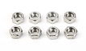

# 睿登RD6006+华为PAC460S55可调直流电源DIY

使用睿登RD6006表头(60V/6A)与华为PAC460S55开关电源(55V/8.37A)，实际最大输出53.9V/6A

## 外观
宽度199mm 总高度98mm 前后深165mm

## 元件列表
图片|型号|参数说明|数量|单价|备注
-|-|-|-|-|-
|睿登RD6006表头|降压型电源 输出0-60V 0-6A|1|￥319|[淘宝](https://item.taobao.com/item.htm?spm=a1z09.2.0.0.67002e8dqWySwg&id=602937441535&_u=5okvj8174fb)
|华为PAC460S55开关电源|输出55V 8.37A|1|￥98|闲鱼二手
|鳄鱼夹香蕉头电源线2根|18AWG 硅胶铜线|1|￥19.8|[淘宝](https://detail.tmall.com/item.htm?_u=5okvj81b6e4&id=634158487969&skuId=4523359980725&spm=a1z09.2.0.0.67002e8dqWySwg)
|温控散热风扇|三档转速 输入6-70VDC 5cm|1|￥20.8|[淘宝](https://item.taobao.com/item.htm?spm=a1z09.2.0.0.67002e8dqWySwg&id=649882617949&_u=5okvj815291)
|AC品字电源插座|开关带灯带保险丝带线|1|￥6.5|[淘宝](https://item.taobao.com/item.htm?spm=a1z09.2.0.0.67002e8dqWySwg&id=540897139554&_u=5okvj818d1f)
|国标电源线|10A 2500W 1m|1|￥7.5|[淘宝](https://detail.tmall.com/item.htm?_u=5okvj81e6f0&id=659755517309&skuId=4931697186161&spm=a1z09.2.0.0.67002e8dqWySwg)
|电源座接插件公壳|5.08mm间距 4p剪去一个用作3p|1|￥2.5/20只|[淘宝](https://item.taobao.com/item.htm?spm=a1z09.2.0.0.67002e8dqWySwg&id=677115625166&_u=5okvj81f793)
|电源座接插件母端子|5.08mm间距|3|￥3.5/50只|[淘宝](https://item.taobao.com/item.htm?spm=a1z09.2.0.0.67002e8dqWySwg&id=677115625166&_u=5okvj81f793)
|5557空中对插连接线公头4P|4.2mm间距 长30cm|1|￥3.2/2条|[淘宝](https://item.taobao.com/item.htm?spm=a1z09.2.0.0.67002e8dqWySwg&id=656065048897&_u=5okvj8119d2)
|XH2.54硅胶线|2P 单头 30cm|1|￥0.76|[淘宝](https://item.taobao.com/item.htm?spm=a1z09.2.0.0.67002e8dqWySwg&id=708344136730&_u=5okvj817f7e)
|XH2.54母座|2P直针|1|￥0.3/10个|[淘宝](https://item.taobao.com/item.htm?spm=a1z09.2.0.0.67002e8dqWySwg&id=709943001795&_u=5okvj812064)
|温度探头延长转接板|需要额外加工安装孔（也可使用洞洞板）|1|￥0.38|[淘宝](https://item.taobao.com/item.htm?spm=a1z09.2.0.0.67002e8dqWySwg&id=646170041743&_u=5okvj814370)
|外壳|3号箱 199\*165\*98 前后面板定制开孔|1|￥35|[淘宝](https://item.taobao.com/item.htm?spm=a1z09.2.0.0.67002e8dqWySwg&id=729841708534&_u=5okvj8161a2)
|M3六角铜柱|6+6mm|8|￥3/20只|[淘宝](https://item.taobao.com/item.htm?spm=a1z09.2.0.0.67002e8dqWySwg&id=589247118183&_u=5okvj811e90)
|圆头螺丝钉|M3\*6|10|￥3.26/100粒|[淘宝](https://detail.tmall.com/item.htm?_u=5okvj81fb3e&id=41636092499&spm=a1z09.2.0.0.67002e8dqWySwg&skuId=4912747278099)
|圆头螺丝钉|M3\*20|8|￥3.21/50粒|[淘宝](https://detail.tmall.com/item.htm?_u=5okvj81fb3e&id=41636092499&skuId=4917417439480&spm=a1z09.2.0.0.67002e8dqWySwg)
|螺母|M3|18|￥2.43/100粒|[淘宝](https://detail.tmall.com/item.htm?_u=5okvj813ddb&id=584261292036&spm=a1z09.2.0.0.67002e8dqWySwg&skuId=4799683688195)
|尼龙垫片|M3\*6\*1|24|￥3.19/200粒|[淘宝](https://detail.tmall.com/item.htm?_u=5okvj8188e4&id=18249318749&spm=a1z09.2.0.0.67002e8dqWySwg&skuId=4981675428579)
-|合计|||￥532.33|

## 接线
接线见下图

## 外壳
箱体尺寸如下

前后面板图纸如下（前面板上下边框比较窄可能无法加工，此时只保留两侧即可，或者加工宽一些再裁掉）（面板四角自带的安装孔未画出）

塑料框高度比表头高度小，前框需要裁掉一些，由于前面板改用M3螺丝螺母固定，前面四个安装孔需要扩一下，另外需要在底部钻四个孔安装铜柱以固定PAC460S55，如下图所示

## 安装
安装说明见下表

安装项|螺丝使用
-|-
前面板|M3\*20螺丝\*4、M3螺母\*4、M3\*6\*1尼龙垫片\*12
开关电源|M3\*6螺丝\*4、M3铜柱\*4、M3螺母\*4、垫片\*8
品字电源插座|M3\*6螺丝\*2、M3螺母\*2
风扇|M3\*20螺丝\*4、M3螺母\*4
风扇控制板|M3\*6螺丝\*2、M3铜柱\*2、M3螺母\*2、垫片\*2
温度探头延长转接板|M3\*6螺丝\*2、M3铜柱\*2、M3螺母\*2、垫片\*2
外壳|外壳附带的自攻螺丝

